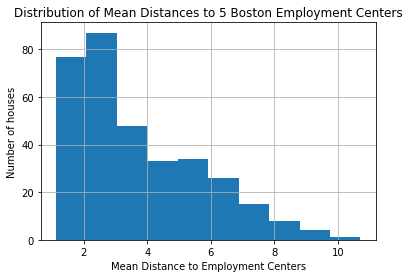
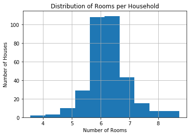
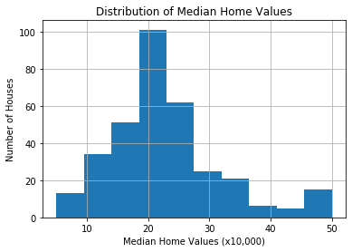
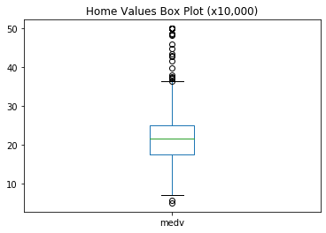
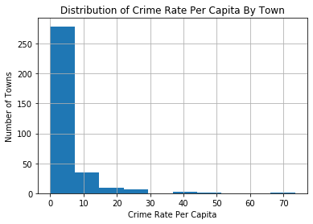
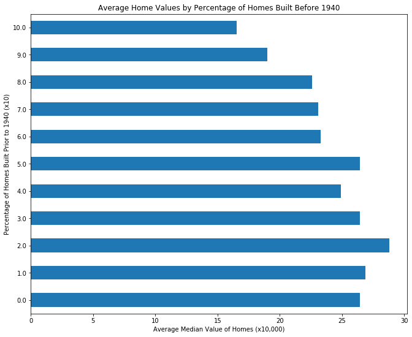

# Project - EDA with Pandas Using the Boston Housing Data

## Introduction

In this small project, I am going to display an Exploratory Data Analysis (EDA) process on the popular Boston Housing Data, using the objectives & goals listed below as a guide.

## Objective

* Perform a short, but meaningful, exploratory data analysis to gain insight about this dataset. 

## Goals
 
* Discover if there are null values.
* Use a scatter plot, histograms, & box plots to investigate distributions.
* Write a loop to discover highly correlated variables
* Choose 3 or 4 variables for which to explore, plot, and provide brief analyses on their distributions.
* Perform an advanced analysis on 1 feature

## Variable Descriptions

This DataFrame contains the following columns:

- `crim`: per capita crime rate by town  
- `zn`: proportion of residential land zoned for lots over 25,000 sq.ft  
- `indus`: proportion of non-retail business acres per town   
- `chas`: Charles River dummy variable (= 1 if tract bounds river; 0 otherwise)  
- `nox`: nitrogen oxide concentration (parts per 10 million)   
- `rm`: average number of rooms per dwelling   
- `age`: proportion of owner-occupied units built prior to 1940  
- `dis`: weighted mean of distances to five Boston employment centers   
- `rad`: index of accessibility to radial highways   
- `tax`: full-value property-tax rate per \$10,000   
- `ptratio`: pupil-teacher ratio by town    
- `b`: 1000(Bk - 0.63)^2 where Bk is the proportion of African American individuals by town   
- `lstat`: lower status of the population (percent)   
- `medv`: median value of owner-occupied homes in $10000s 


```python
import pandas as pd
import matplotlib.pyplot as plt
%matplotlib inline
```


```python
#Loading the data
df = pd.read_csv('train.csv')
print(len(df))
df.head()
```

    333


<div>
<style scoped>
    .dataframe tbody tr th:only-of-type {
        vertical-align: middle;
    }

    .dataframe tbody tr th {
        vertical-align: top;
    }

    .dataframe thead th {
        text-align: right;
    }
</style>
<table border="1" class="dataframe">
  <thead>
    <tr style="text-align: right;">
      <th></th>
      <th>ID</th>
      <th>crim</th>
      <th>zn</th>
      <th>indus</th>
      <th>chas</th>
      <th>nox</th>
      <th>rm</th>
      <th>age</th>
      <th>dis</th>
      <th>rad</th>
      <th>tax</th>
      <th>ptratio</th>
      <th>b</th>
      <th>lstat</th>
      <th>medv</th>
    </tr>
  </thead>
  <tbody>
    <tr>
      <td>0</td>
      <td>1</td>
      <td>0.00632</td>
      <td>18.0</td>
      <td>2.31</td>
      <td>0</td>
      <td>0.538</td>
      <td>6.575</td>
      <td>65.2</td>
      <td>4.0900</td>
      <td>1</td>
      <td>296</td>
      <td>15.3</td>
      <td>396.90</td>
      <td>4.98</td>
      <td>24.0</td>
    </tr>
    <tr>
      <td>1</td>
      <td>2</td>
      <td>0.02731</td>
      <td>0.0</td>
      <td>7.07</td>
      <td>0</td>
      <td>0.469</td>
      <td>6.421</td>
      <td>78.9</td>
      <td>4.9671</td>
      <td>2</td>
      <td>242</td>
      <td>17.8</td>
      <td>396.90</td>
      <td>9.14</td>
      <td>21.6</td>
    </tr>
    <tr>
      <td>2</td>
      <td>4</td>
      <td>0.03237</td>
      <td>0.0</td>
      <td>2.18</td>
      <td>0</td>
      <td>0.458</td>
      <td>6.998</td>
      <td>45.8</td>
      <td>6.0622</td>
      <td>3</td>
      <td>222</td>
      <td>18.7</td>
      <td>394.63</td>
      <td>2.94</td>
      <td>33.4</td>
    </tr>
    <tr>
      <td>3</td>
      <td>5</td>
      <td>0.06905</td>
      <td>0.0</td>
      <td>2.18</td>
      <td>0</td>
      <td>0.458</td>
      <td>7.147</td>
      <td>54.2</td>
      <td>6.0622</td>
      <td>3</td>
      <td>222</td>
      <td>18.7</td>
      <td>396.90</td>
      <td>5.33</td>
      <td>36.2</td>
    </tr>
    <tr>
      <td>4</td>
      <td>7</td>
      <td>0.08829</td>
      <td>12.5</td>
      <td>7.87</td>
      <td>0</td>
      <td>0.524</td>
      <td>6.012</td>
      <td>66.6</td>
      <td>5.5605</td>
      <td>5</td>
      <td>311</td>
      <td>15.2</td>
      <td>395.60</td>
      <td>12.43</td>
      <td>22.9</td>
    </tr>
  </tbody>
</table>
</div>


```python
df.info()
#No null values
```

    <class 'pandas.core.frame.DataFrame'>
    RangeIndex: 333 entries, 0 to 332
    Data columns (total 15 columns):
    ID         333 non-null int64
    crim       333 non-null float64
    zn         333 non-null float64
    indus      333 non-null float64
    chas       333 non-null int64
    nox        333 non-null float64
    rm         333 non-null float64
    age        333 non-null float64
    dis        333 non-null float64
    rad        333 non-null int64
    tax        333 non-null int64
    ptratio    333 non-null float64
    b          333 non-null float64
    lstat      333 non-null float64
    medv       333 non-null float64
    dtypes: float64(11), int64(4)
    memory usage: 39.1 KB


```python
#Investigating Distributions
pd.plotting.scatter_matrix(df, figsize=(11,11));
```


```python
import numpy as np
for n, feat1 in enumerate(df.columns):
    for feat2 in df.columns[n+1:]:
        r2 = np.corrcoef(df[feat1], df[feat2])[0][1]
        if r2 > .7:
            print('{} and {} have a correlation coefficient of {}'.format(feat1, feat2, r2))
```

    ID and rad have a correlation coefficient of 0.7075262711727565
    indus and nox have a correlation coefficient of 0.7500874390908759
    indus and tax have a correlation coefficient of 0.7083132697607584
    nox and age have a correlation coefficient of 0.7359995828422857
    rad and tax have a correlation coefficient of 0.9035618963206118


### Distance


```python
df['dis'].hist();
plt.title('Distribution of Mean Distances to 5 Boston Employment Centers')
plt.xlabel('Mean Distance to Employment Centers')
plt.ylabel('Number of houses');
```





Analysis: This is a skewed distribution. Most houses in this sample are fairly close to the employment centers, while only a few are far.

### Rooms


```python
df['rm'].hist();
plt.title('Distribution of Rooms per Household')
plt.xlabel('Number of Rooms')
plt.ylabel('Number of Houses');
```





Analysis: The number of rooms in these houses is pretty normally distributed. The average number of rooms is around 6 rooms.

### Median Value


```python
df['medv'].hist();
plt.title('Distribution of Median Home Values')
plt.xlabel('Median Home Values (x10,000)')
plt.ylabel('Number of Houses');
```





```python
df['medv'].plot(kind='box', title='Home Values Box Plot (x10,000)');
```





Analysis: The histogram has a slight skew. Most of these homes are valued around $200,000. However, the box plot shows that there are a handful of outliers, represented by the small dots, particularly in what looks to be the overvaluation of homes.

### Crime Rate Per Capita Per Town


```python
df['crim'].min()
```


    0.00632


```python
df['crim'].quantile(.5)
```


    0.26169000000000003


```python
df['crim'].max()
```


    73.5341


```python
df['crim'].hist();
plt.title('Distribution of Crime Rate Per Capita By Town')
plt.xlabel('Crime Rate Per Capita')
plt.ylabel('Number of Towns');
```





Analysis: This feature has a significant skew, and the vast majority of towns have a crime rate per capita of less than 10.

### Advanced Analysis: Feature engineering new column, `proportion`, and comparing average median home value

To serve as a reminder, the `age` column is described as "proportion of owner-occupied units built prior to 1940". I will be dividng `age` into 10 groups, which will be called `proportion`, with each group being the collection of homes having x percentage being built prior to 1940. Then, I will plot the average median home values for each group, and analyze my results after that.


```python
df['age'].head()
```


    0    65.2
    1    78.9
    2    45.8
    3    54.2
    4    66.6
    Name: age, dtype: float64


```python
df['age'].describe()
```


    count    333.000000
    mean      68.226426
    std       28.133344
    min        6.000000
    25%       45.400000
    50%       76.700000
    75%       93.800000
    max      100.000000
    Name: age, dtype: float64


```python
df['proportion'] = df.age // 10
df['proportion'].head()
#Grouping matches values from df['age'] in cell 14
```


    0    6.0
    1    7.0
    2    4.0
    3    5.0
    4    6.0
    Name: proportion, dtype: float64


```python
df['proportion'].describe()
#Very similair measures compared with df['age']
```


    count    333.000000
    mean       6.339339
    std        2.872100
    min        0.000000
    25%        4.000000
    50%        7.000000
    75%        9.000000
    max       10.000000
    Name: proportion, dtype: float64


```python
to_plot = df.groupby('proportion').medv.mean()
to_plot.plot(kind='barh', figsize=(11,9))
plt.ylabel('Percentage of Homes Built Prior to 1940 (x10)')
plt.xlabel('Average Median Value of Homes (x10,000)')
plt.title('Average Home Values by Percentage of Homes Built Before 1940');
```





Analysis: In general, there is a visible trend showing that towns with a smaller percentage of homes built before 1940 have higher average median values. Interestingly, towns in group 5 (50-59.99%) have a similair average median home value to towns in group 3 (30-39.99%) and group 0 (0-9.99%). Group 2 (20-29.99%) has the highest average median home value of almost 300,000 dollars, while group 10 (100 percent) has the lowest average median home value, slightly over $150,000. 


```python

```
